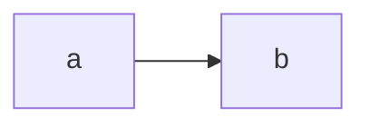

# Embedding diagrams in docs sites

Two pieces work together:

- **`<mermaid-archify>`** (`mermaid-archify/element`): a custom element that shows an
  interactive diagram inside any page. It lives in shadow DOM, so the site's CSS can't
  break it, follows the site's light/dark theme, only reacts to keyboard shortcuts while
  it has focus, and does nothing until it scrolls near the viewport.
- **Markdown plugins** (`mermaid-archify/remark`, `mermaid-archify/markdown-it`): turn
  ```` ```mermaid ```` code blocks into that element **at build time**. Pages then ship
  only the viewer (≈90 KB minified, ≈31 KB gzipped) and the laid-out diagram, never
  Mermaid or ELK.

## The element

```html
<script type="module" src="/path/to/mermaid-archify.js"></script>

<!-- Mermaid source inline (rendered in the browser; loads Mermaid + ELK on demand) -->
<mermaid-archify height="420">
  flowchart LR
    web[Web App] --> api[[Checkout API]] --> db[(Postgres)]
</mermaid-archify>

<!-- Source with HTML in labels: wrap it so the browser doesn't parse it -->
<mermaid-archify>
  <script type="text/mermaid">
    flowchart TB
      a[Request<br>arrives] --> b
  </script>
</mermaid-archify>

<!-- A .mmd file, or a Scene laid out ahead of time (render(source).scene, saved as JSON) -->
<mermaid-archify src="/diagrams/checkout.mmd"></mermaid-archify>
<mermaid-archify scene="/diagrams/checkout.json" theme="light" controls="false"></mermaid-archify>
```

In a bundled app, `import 'mermaid-archify/element'` registers the element; importing it
during server-side rendering is harmless.

| Attribute | |
|---|---|
| `scene` | URL of a Scene JSON file (what `render()` returns as `scene`). |
| `src` | URL of a Mermaid file, rendered in the browser. |
| `scene-json` | A Scene, inline. The Markdown plugins write this (or a child `<script type="application/json">`). |
| `theme` | `auto` (default), `light` or `dark`. `auto` follows `<html data-theme>` (Docusaurus), then `<html class="dark">` (VitePress, Tailwind), then the OS setting, and updates live. |
| `height` | CSS length; a bare number is pixels. Default `480px`. |
| `controls` | `false` hides the toolbar, legend and minimap. |

Content is taken from the first of `scene`, inline JSON, `src` and the element's text
that is present. Only Mermaid source (`src` or text) loads Mermaid + ELK; that code is a
separate chunk next to the element, so keep the `chunks/` folder beside it.

The element also has a `scene` property (set it to render a Scene you already have), and
fires `ma-ready` (`detail.scene`) or `ma-error` (`detail.message`).

Behaviour on a page:

- **Keyboard**: click or tab into a diagram, then `/`, `+`, `-`, `0`, `T` and `Esc` work
  on that diagram only.
- **Scrolling**: the mouse wheel scrolls the page until the diagram has focus; then it
  pans. Ctrl/⌘ + wheel and pinch always zoom.
- **Theme toggle** in the toolbar changes that diagram only, never the page.
- **Fonts**: shadow DOM can't load web fonts, so the diagram uses JetBrains Mono when
  the page provides it and the system monospace font otherwise.
- `mermaid-archify:not(:defined) { visibility: hidden }` hides inline source until the
  script has loaded.

## Markdown plugins

Both plugins take the same options:

| Option | |
|---|---|
| `mode` | `'build'` (default): lay out at build time. `'client'`: emit the source and render in the browser. |
| `theme`, `height`, `controls` | Default attributes for every diagram. |
| `layout` | Layout overrides for every diagram (as in `render()`), on top of each diagram's front-matter. |
| `languages` | Code block languages to replace. Default `['mermaid', 'mermaid-archify']`. |
| `onError` | `'throw'` (default) fails the build with `file:line: message`; `'warn'` logs and renders the source client-side, so the page shows the error. |

A code block's info string can override the attributes for that diagram:

````md

````

`mermaid-archify/remark` also has `mdx` (default: detected; Docusaurus and other MDX
pipelines get a JSX element). `mermaid-archify/markdown-it` also has `vue` (set it for
VitePress: Vue's template compiler drops `<script>` tags, so the Scene goes in an attribute).

markdown-it renders synchronously, so its plugin lays diagrams out in a worker thread and
waits for it; each distinct diagram is rendered once per build.

## Docusaurus

```js
// docusaurus.config.js
import remarkMermaidArchify from 'mermaid-archify/remark';

export default {
  // ...
  presets: [
    [
      'classic',
      {
        docs: { beforeDefaultRemarkPlugins: [remarkMermaidArchify] },
        blog: { beforeDefaultRemarkPlugins: [remarkMermaidArchify] },
      },
    ],
  ],
  clientModules: ['./src/mermaid-archify.js'],
};
```

```js
// src/mermaid-archify.js
import 'mermaid-archify/element';
```

Use `beforeDefaultRemarkPlugins` so the blocks are replaced before any other Mermaid
handling (you don't need `@docusaurus/theme-mermaid` for these blocks). Docusaurus sets
`<html data-theme>`, so diagrams follow its colour mode switch.

## VitePress

```ts
// .vitepress/config.ts
import { defineConfig } from 'vitepress';
import markdownItMermaidArchify from 'mermaid-archify/markdown-it';

export default defineConfig({
  markdown: {
    config: (md) => md.use(markdownItMermaidArchify, { vue: true }),
  },
  vue: {
    template: { compilerOptions: { isCustomElement: (tag) => tag === 'mermaid-archify' } },
  },
});
```

```ts
// .vitepress/theme/index.ts
import DefaultTheme from 'vitepress/theme';

export default {
  extends: DefaultTheme,
  async enhanceApp() {
    if (!import.meta.env.SSR) await import('mermaid-archify/element');
  },
};
```

VitePress toggles `<html class="dark">`, which diagrams follow.

## MkDocs

MkDocs is Python, so the JavaScript plugins don't run in its build. Render in the browser
with a custom fence (`pymdownx.superfences`) and a small module script:

```yaml
# mkdocs.yml
markdown_extensions:
  - pymdownx.superfences:
      custom_fences:
        - name: mermaid
          class: mermaid-archify
          format: !!python/name:pymdownx.superfences.fence_div_format
extra_javascript:
  - path: js/mermaid-archify-fences.js
    type: module
```

```js
// docs/js/mermaid-archify-fences.js; copy dist-element/ to docs/js/mermaid-archify/
import './mermaid-archify/mermaid-archify.js';

for (const div of document.querySelectorAll('div.mermaid-archify')) {
  const el = document.createElement('mermaid-archify');
  el.textContent = div.textContent;
  div.replaceWith(el);
}
```

To skip Mermaid in the browser, lay diagrams out ahead of time with the library
(`render(source).scene`, saved as JSON) and use
`<mermaid-archify scene="diagrams/checkout.json"></mermaid-archify>` in the page.

## Other sites

- **Astro, Next.js MDX, unified pipelines**: add `mermaid-archify/remark` to the remark
  plugins and load `mermaid-archify/element` on the client. With plain remark-rehype no
  `allowDangerousHtml` is needed: the plugin produces a regular element node.
- **Eleventy and other markdown-it users**: `md.use(markdownItMermaidArchify)`, and add
  the element script to the layout.

See `embed.html` (`npm run dev`, then `/embed.html`) for several diagrams on one page.
